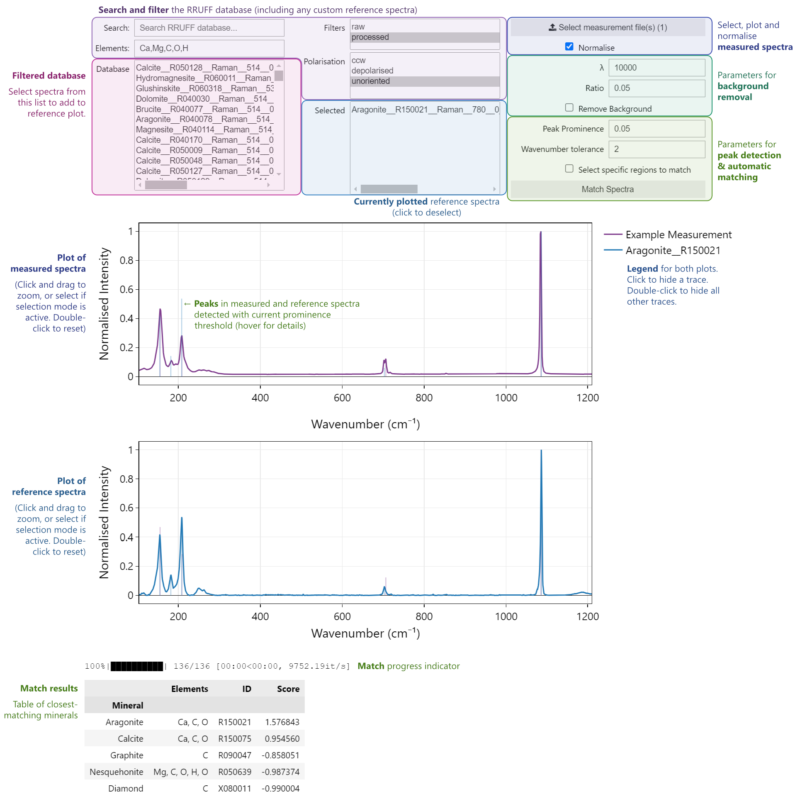

# Ramanalysis
An interactive Python tool for comparing and matching Raman spectra.

This program is inspired by the Raman Match software, but with a more responsive Jupyter Widgets-based interface and improved matching algorithm. We are thankful to the authors of Raman Match for providing their open-source code, without which the development of Ramanalysis would have been much more challenging. Please find the Raman Match paper and GitHub repository linked below.

Berrada, McFall & Chen (2025). Raman Match: Application for automated identification of minerals from Raman spectroscopy data. *American Mineralogist* 110, 25–33. doi:[10.2138/am-2023-9227](https://doi.org/10.2138/am-2023-9227).

[github.com/meryemberradauwo/RamanMatch](https://github.com/meryemberradauwo/RamanMatch)

### Prerequisites
This program requires a Python 3 installation with the following libraries:
- IPython Kernel (ipykernel)
- NumPy
- Pandas
- SciPy
- Jupyter Widgets (ipywidgets)
- tqdm
- Plotly (due to a known issue with Plotly v6, please install Plotly v5.24)

These can be installed using the terminal command
```
pip install ipykernel numpy pandas scipy ipywidgets tqdm plotly==5.24
```
with your Python environment active.

### Database
Before running the main Ramanalysis notebook, you must first generate the Raman spectrum SQL database for comparison. This can be done by running
```
python Create_Raman_db.py
```
when navigated to this directory, with your Python environment active.

`Create_Raman_db.py` can be edited to change the database files that are downloaded from rruff.info, or add custom spectra from a local zip file.

### Interface Tour


### Usage
Once the database has been created, open `Ramanalysis.ipynb` in Jupyter Lab, Visual Studio Code, DataSpell, or other equivalent software. Run the first three code cells in this notebook, and the interface should appear.

The boxes in the left hand column can be used to search for reference spectra in the database. Further refine the search using the filters in the central column. These support the selection of multiple options by holding the control/command key.

Select a spectrum from the "database" list to plot it on the lower graph. The name of the file will be moved to the "selected" box – click on spectra in this box to remove them from the plot.

Click on the "select measured spectra" button to open a file picker to select your measured spectrum or spectra (.txt or .csv format, containing columns for wavenumber and intensity). This window also supports multiple selection using control/command. These spectra will be plotted on the upper plot.

The plots have synchronised x axes and can be zoomed by clicking and dragging on the plot (as long as the selection mode is not activated). Double-click on the plot to reset the zoom. The plots can be panned by clicking and dragging on the axes. Use the tick-boxes in the right-hand column to toggle normalisation of spectra and visual removal of the background (using ARPLS, with the parameters λ and ratio). Peaks will be displayed on both plots as lines if their prominence is above the threshold in the "peak prominence" box.

Clicking the "Match Spectra" button will search through all spectra in the "Database" box (respecting any filters / search criteria and ignoring spectra already plotted) and find the spectra that best match the last selected measured spectrum, according to the matching algorithm. Reference spectra gain points for each peak that is present within a given wavenumber tolerance (defined in the box) in the measured spectrum, scaled by the similarity in prominences between the spectra and the prominence of the peak in the reference spectrum. Points are lost for each peak absent from the measured spectrum, again scaled by the prominence of the peak and a "penalty factor". Only peaks higher than the value in the "peak prominence" box will be considered. The five minerals with the highest score will be displayed in a table, and the highest-scoring spectrum will be added to the reference plot.

If only certain regions of the spectrum should be matched (for example, if there is a mixture of phases and one has already been matched), tick the "select specific regions to match" box, then click and drag horizontally on either plot to select a region. Multiple regions can be selected by holding the Shift key. The selection can be removed by double clicking on the plot. When clicking "Match Spectra" when there are selected regions on the graph, only peaks with wavenumbers that lie within the selected ranges (on either plot) are considered. Untick the box to go back to zoom mode (though selected regions will remain unless they are deselected before).